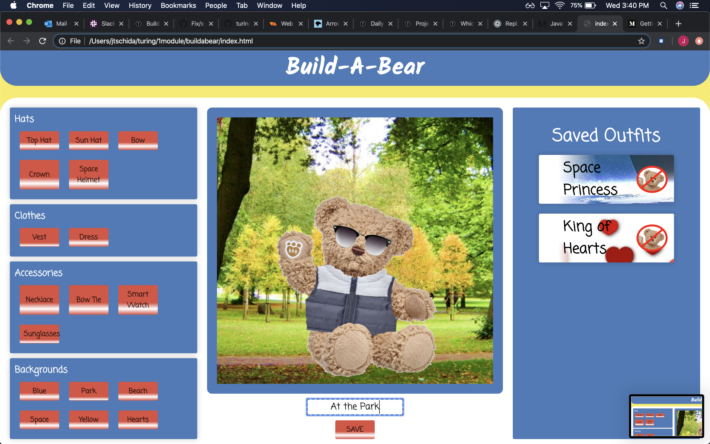

# Build-A-Bear Group Project

### Overview

This is a group project assigned to us in Mod 1 at Turing.  We were asked to recreate a basic wireframe of a comp, styling it how we see fit and then add functionality.  The overall goal was to create a user experience where they could dress a bear with various clothing items and backdrops and save their outfits, which they could then load and edit by clicking cards representing the saved outfits.

The webpage was created with HTML and CSS and the functionality was handled by Javascript.  The project primarily relied on DOM manipulation and its interaction with a data model and local storage. Creating a simple yet effective data model turned out to be the most integral part to our success on this project.  Working on a larger group also proved to be a challenge in the early days of the project, but through kind and open communication we were able to come to an understanding that improved the group workflow.

### Screenshots

#### The Comp We Were Given

#### Our Website

### Contributors
